# Laporan Praktikum
| MatKul | Pemrograman Berbasis Framework |
| ---    | ---           |
| Nama   | Faricha Aulia |
| NIM    | 2141720155    |
| Kelas  | TI - 3I       |


<table><tr><td>Saya melampirkan screenshot dari setiap step yang saya lakukan pada src/assets</td></tr></table>

## Pertanyaan 1 dan Jawaban
> "Ubah isi kode Home() sehingga dapat tampil seperti berikut dengan memanfaatkan komponen Profile() yang tadi sudah dibuat dari langkah 1 tersebut!"

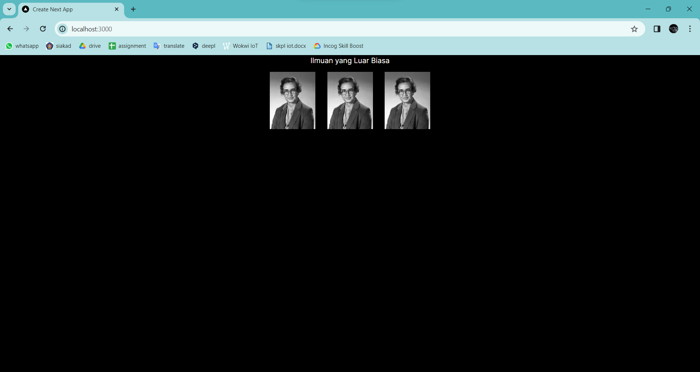

**Eror dapat diperbaiki** dengan proses sebagai berikut:
1. Pada komponen Profile, menggunakan komponen Image dari Next.js untuk menampilkan gambar Katherine Johnson dari URL yang diberikan.
2. Lalu mengimpor dan menggunakan komponen Profile dalam halaman Page.
3. Dalam konfigurasi Next.js, ditambahkan pola URL gambar eksternal ke daftar pola yang diizinkan agar gambar dari i.imgur.com dapat dimuat.
```typescript
/** @type {import('next').NextConfig} */
const nextConfig = {
    images: {
        remotePatterns: [
            {
                protocol: "https",
                hostname: "i.imgur.com",
            },
        ],
    },
};
export default nextConfig;
```
4. Maka tidak ada error yang terjadi saat merender halaman karena gambar dapat dimuat dari URL yang diberikan dalam komponen Profile.

---

## Pertanyaan 2 dan Jawaban
> "(Buat komponen gallery dan impor) Jelaskan apa yang telah Anda pelajari dan bagaimana tampilannya saat ini?"

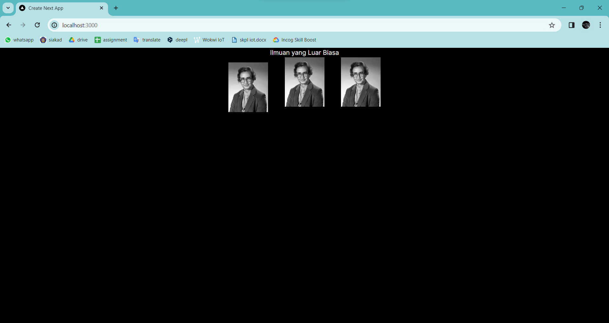

**Yang saya pelajari**
Saya dapat menggunakan komponen yang dapat menggunakan komponen lainnya berkali-kali

**Penjelasan perubahan tampilan**
Tampilan sedikit berubah karena gambar tidak lagi dibungkus dalam elemen <div> seperti sebelumnya. Ini menunjukkan fleksibilitas dalam penggunaan komponen dalam pengembangan aplikasi web dengan React dan Next.js, serta pentingnya penyesuaian antarmuka dengan struktur komponen yang digunakan.

---

## Pertanyaan 3 dan Jawaban
> "(Perbaiki kode yang diberikan) Jelaskan apa yang telah Anda pelajari dan mengapa error itu bisa terjadi?"

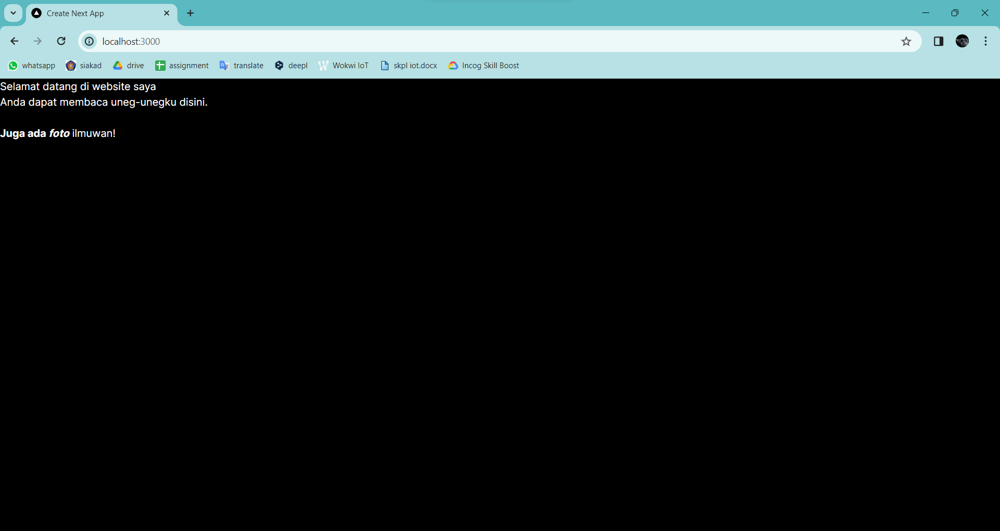

**Penyebab error dan penyelesaiannya :**
- Menggunakan atribut <p class=""> untuk menetapkan kelas CSS pada elemen HTML. Dalam JSX React seharusnya menggunakan atribut <p className=""> untuk itu.
- Markup HTML tidak ditutup dengan baik. Tag pembuka <div> tidak memiliki tag penutup, dan tag pembuka <b> dan <i> juga tidak ditutup dengan benar. Tag <br> harus ditutup sebagai <br />. 

--- 

## Pertanyaan 4 dan Jawaban
> "Perbaiki kode TodoList"

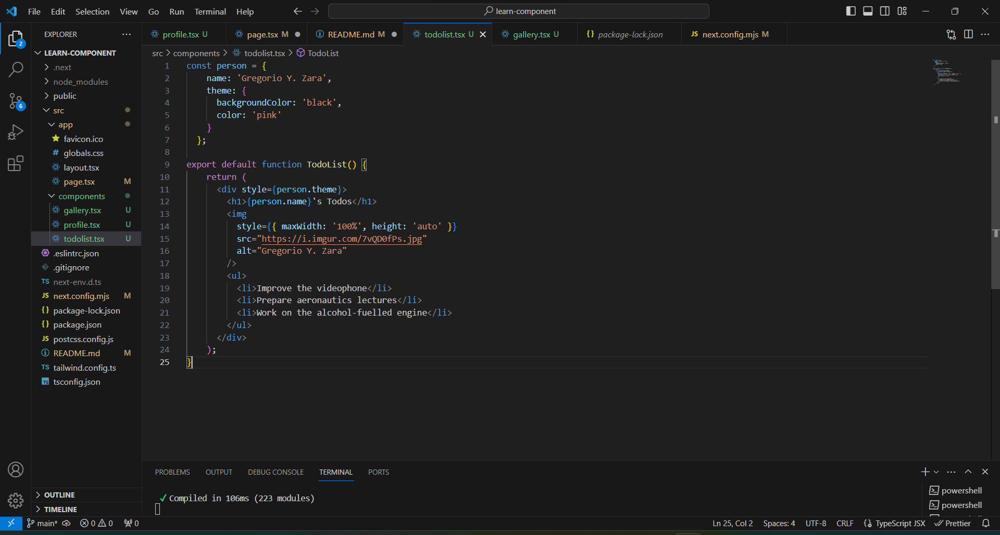

**Perbaikan :**
- Pada elemen <h1>, kita menampilkan nama dari objek person.
- Pada elemen , kita menggunakan properti style untuk menetapkan gaya langsung pada elemen tersebut.
- Properti style pada elemen  ditambahkan untuk memastikan gambar ditampilkan dengan benar.

---

## Pertanyaan 5 dan Jawaban 
> "(Impor komponen) Apakah ada perbedaan pada tampilan web saat ini?"

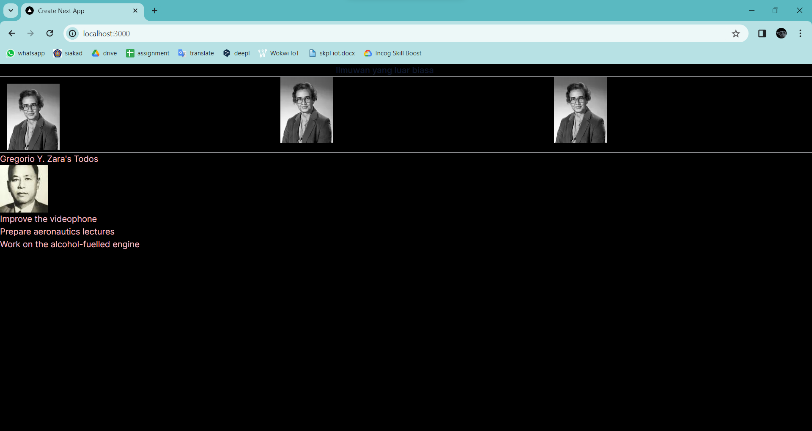

**Perubahan :**
- Sebuah judul "Ilmuwan yang luar biasa" dengan gaya teks yang ditetapkan menggunakan kelas CSS.
- Garis horizontal memisahkan judul dari komponen Gallery.
- Komponen Gallery, menampilkan gambar ilmuwan.
- Garis horizontal memisahkan komponen Gallery dari komponen TodoList.
- Komponen TodoList, menampilkan apa yang akan dilakukan oleh ilmuwan Gregorio Y. Zara

---

## Pertanyaan 6 dan Jawaban 
> "(Perbaiki kode atribut src) Jelaskan apa yang telah Anda pelajari dan bagaimana tampilannya saat ini? Untuk memeriksa apakah perbaikan Anda berhasil, coba ubah nilai dari imageSize menjadi 'b'. Gambar harus menyesuaikan ukuran setelah diubah."

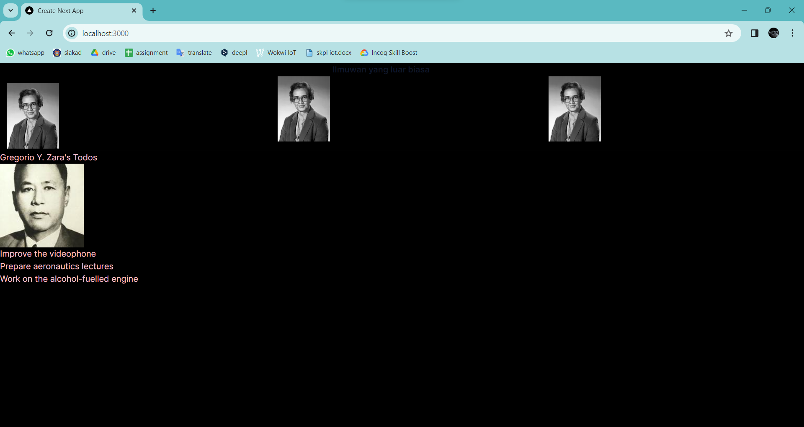
Gambar berhasil menyesuaikan ukuran.

**Perbaikan kode :**
- Variabel baseUrl, person.imageId, dan person.imageSize digabungkan langsung dalam string untuk membentuk URL gambar yang lengkap.
- Variabel baseUrl dan string lainnya digabungkan dengan operator + untuk membentuk string yang tepat untuk atribut src.

**Penjelasan :**
1. *Manipulasi URL:* Dengan menggunakan ekspresi JavaScript di dalam JSX. Ini memungkinkan pengaturan dinamis untuk URL gambar dengan menggabungkan berbagai bagian seperti baseUrl, id gambar, ukuran gambar, dan ekstensi file.
2. *Penggunaan Variabel:* Variabel digunakan untuk menyimpan bagian-bagian dari URL gambar seperti baseUrl, imageId, dan imageSize. Ini memungkinkan pengaturan atau perubahan URL dengan mudah tanpa memodifikasi setiap lokasi di mana URL digunakan.
4. *Pemisahan Tugas:* Dengan menggunakan variabel, tugas dalam kode dapat dipisahkan dengan baik. Misalnya, baseUrl disimpan sebagai variabel global, sedangkan bagian-bagian unik dari URL disimpan pada objek person. Ini membuat kode lebih mudah dipahami dan dikelola.
4. *Konsistensi Tampilan:* Perubahan pada kode hanya mempengaruhi cara URL gambar dibangun, namun tidak mempengaruhi tampilan keseluruhan dari komponen. Ini membantu mempertahankan konsistensi dalam tampilan antarmuka pengguna.

---

## Pertanyaan 7 dan Jawaban 
> "Buat Komponen MyGallery berisi dua markup yang sama persis. Ekstraklah menjadi komponen MyProfile untuk mengurangi duplikasi. Anda perlu memilih props apa saja yang akan dikirimkan. Jelaskan apa yang telah Anda pelajari dan bagaimana tampilannya saat ini?"

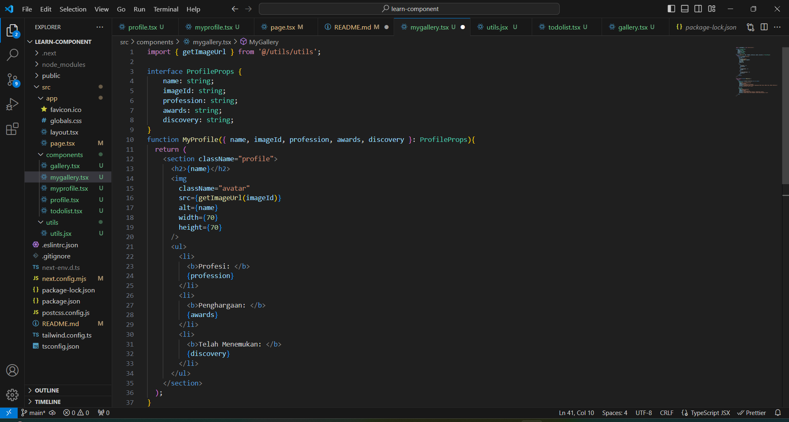
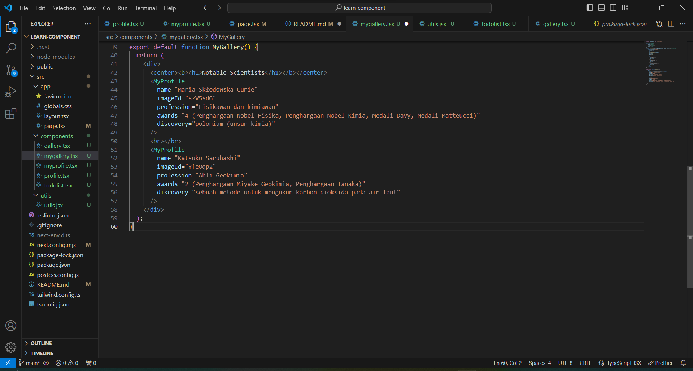
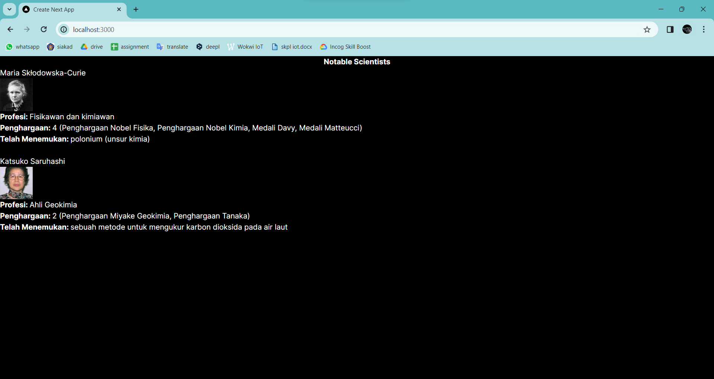

**Penjelasan:**
1. *Import Modul Eksternal.* Mengimpor fungsi getImageUrl dari modul eksternal @/utils/utils. 
2. *Deklarasi Interface.* Interface ProfileProps digunakan untuk mendefinisikan struktur data yang diharapkan untuk properti-properti yang akan diterima oleh komponen MyProfile. 
3. *Deklarasi Komponen MyProfile.* Menampilkan profil ilmuwan. 
4. *Penggunaan Komponen MyProfile.* Komponen MyProfile digunakan dalam komponen MyGallery untuk menampilkan profil ilmuwan tertentu. Setiap penggunaan komponen MyProfile memiliki properti-properti yang berbeda yang diteruskan ke komponen MyProfile sesuai dengan data yang sesuai untuk ilmuwan yang bersangkutan.
5. *Export Fungsi getImageUrl.* Fungsi getImageUrl di-export untuk digunakan di luar modul.

**Kesimpulan:** Dengan memisahkan markup dan logika menjadi komponen yang berbeda, kode menjadi lebih terstruktur dan mudah dipahami. Ini memungkinkan untuk mengelola bagian-bagian dari aplikasi secara terpisah, meningkatkan keterbacaan, dan mempermudah pemeliharaan kode.

---

## Pertanyaan 8 dan Jawaban
> "Ubahlah komponen MyAvatar untuk diolah ukuran gambarnya berdasarkan prop size. Khususnya, jika size kurang dari 90, kirimkan 's' ("small") bukan 'b' ("big") pada fungsi getImageUrl. Pastikan bahwa perubahan yang Anda buat berjalan dengan cara me-render avatars dengan nilai prop size yang berbeda dan buka gambar pada tab baru di browser.Jelaskan apa yang telah Anda pelajari dan bagaimana tampilannya saat ini?"

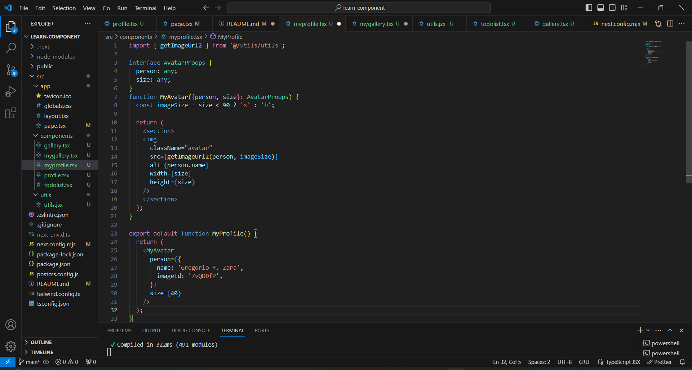
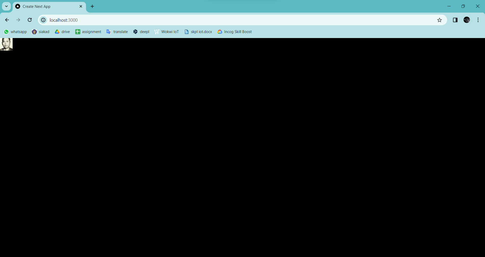

**Penjelasan:**
Menambahkan logika untuk menentukan ukuran gambar berdasarkan prop size. Dengan perubahan ini, komponen MyAvatar menjadi lebih dinamis dan dapat menyesuaikan ukuran gambar berdasarkan nilai prop size.

---

## Pertanyaan 9 dan Jawaban
> "Buatl file baru myprofile2.tsx. Buatlah komponen Card dari kode di atas, lalu gunakan prop children untuk mengirimkan JSX yang berbeda. Jelaskan apa yang telah Anda pelajari dan bagaimana tampilannya saat ini?"

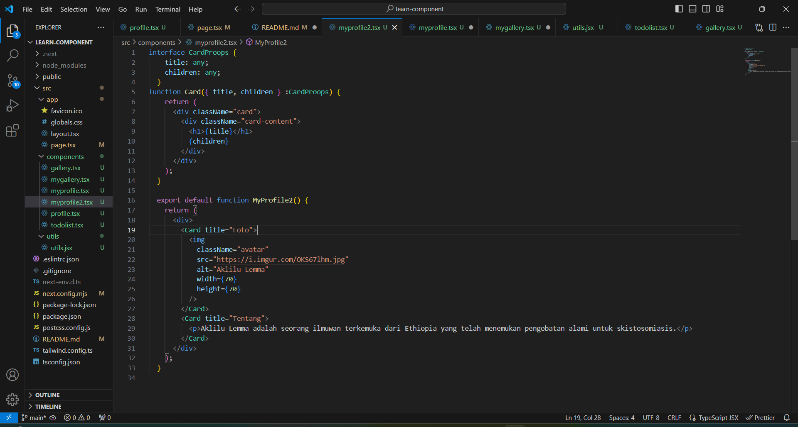
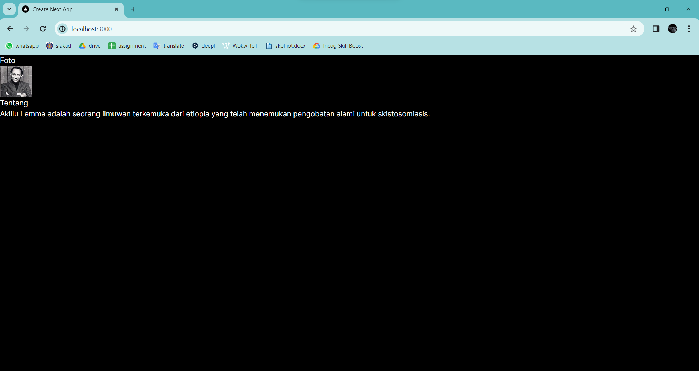

**Penjelasan:**
1. Pemisahan Komponen: Kode menjadi lebih terstruktur, mudah dipahami, dan mudah dikelola.
2. Penggunaan Properti: Saya menggunakan properti untuk mengirim data dari komponen induk ke komponen anak. Properti ini memungkinkan komponen-komponen untuk menjadi lebih fleksibel dan dapat digunakan kembali dengan cara yang berbeda-beda.
3. Penggunaan Prop Children: Saya memahami penggunaan prop children untuk mengirimkan JSX sebagai properti ke komponen. Ini memungkinkan komponen-komponen untuk menerima dan menampilkan konten yang berbeda secara dinamis.